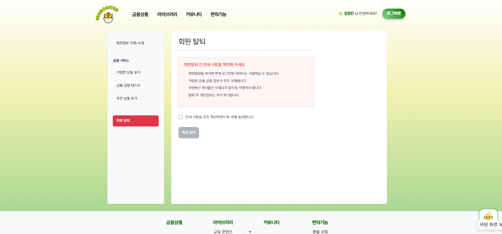

# 🐣 EggMoneyNa - 금융 상품 추천 서비스 
📅 **프로젝트 기간**: 2024.11.18 ~ 2024.11.26

[1. 팀원 소개](#i-팀원-소개)  
[2. 설계 내용](#ii-설계-내용아키텍처-등-및-실제-구현-정도)  
[3. 데이터베이스 모델링 - ERD](#iii-데이터베이스-모델링erd)  
[4. 금융 상품 추천 알고리즘에 대한 기술적 설명](#iv-금융-상품-추천-알고리즘에-대한-기술적-설명)  
[4. 대표 기능 설명](#v-서비스-대표-기능들에-대한-설명)  
[5. 생성형 AI](#vi-생성형-ai-를-활용한-부분)  
[6. 느낀 점](#vii-기타느낀-점-후기-등)

## 서비스 소개
**쉽고 재미있게, 나에게 딱 맞는 예적금 상품을 찾아보세요!**  
금융에 대한 지식이 부족해도 걱정 마세요.  
**금융 초보와 사회 초년생**이 복잡한 금융 상품을 **쉽고 편리하게 이해하고**,  
자신에게 꼭 맞는 예적금 상품을 **선택할 수 있도록 돕는 플랫폼**입니다.

## 🌟 주요 기능

- **금융 상품 정보 제공**  
  예적금 상품의 이자율, 기간, 조건 등을 비교하고 확인할 수 있어요.

- **금융 용어 챗봇 지원**   
  생소하거나 어려운 금융 용어는 챗봇을 통해 쉽게 설명받을 수 있어요.

- **금융 성향 테스트 제공**   
  간단한 테스트로 나의 금융 성향을 4가지 유형 중 하나로 분석하고,  
  해당 유형에 맞는 예적금 상품을 추천해줘요.

- **추천 콘텐츠 제공**  
  금융 지식 향상을 위한 **영상**과 **도서** 콘텐츠를 추천해줘요.

- **사용자 커뮤니티 제공**   
  다른 사용자들과 정보 공유 및 질문/답변이 가능한 커뮤니티 공간이 있어요.

### 🎯 서비스 대상
- 예적금 상품이 처음이라 어려운 **금융 초보**
- 스스로 금융 상품을 비교하기 힘든 **사회 초년생**
- 나에게 꼭 맞는 금융 상품을 **쉽고 빠르게 찾고 싶은 누구나**

## I. 팀원 소개

**👩‍💻 신해인 (Front-End)**

 
    

    
    
     
    
    
    
     
    

**📋 상세 기술 및 역할**
| **language** | **framework** | **기능 구현** |
| --- | --- | --- |
| JavaScript | Vue3 | 커뮤니티 CRUD 기능 프론트 구현 |
| - | axios | 금융 용어 챗봇 데이터 통신 구현 | 
| - | | 유튜브 API를 활용한 금융 관련 영상 제공 |
| - | HTML / CSS | 금융 상품 비교 기능의 시각화 구현 |
| - | | 전반적인 페이지 디자인 및 사용자 친화적인 레이아웃 설계 |

**🧑‍💻 임정인 (Back-End)**

 <!-- Language --> 
    <!-- Framework --> 

    
     <!-- Database --> 

    

**📋 상세 기술 및 역할**
| **language** | **framework** | **기능 구현** |
| --- | --- | --- |
| Python | Django | 사용자 커스터마이징 및 DB 모델링  |
| - | Django-Rest-Framework | 금융상품 추천 알고리즘 구현 및 API 설계  |
| - | dj-rest-auth | 커뮤니티 기능(게시글, 댓글)을 위한 CRUD 및 인증 시스템 구현 |
| - | | 데이터베이스 설계, 구축, 최적화 및 전반적인 관리 |

## II. 설계 내용(아키텍처)
### 구현 기능 설명

1. **메인 페이지**
   - 캐러셀 사용
   - 금주의 추천 상품 등록

2. **회원 커스터마이징**
   - 회원가입(일반 / 전문가), 로그인, 로그아웃
   - 아이디, 비밀번호, 이름, 이메일, 성별, 소득수준, 자격증 종류, 취득일자, 자격증 번호

3. **예적금 금리 비교**
   - 정기 예금 / 정기 적금
   - 은행 이름 별, 예치 기간 별 필터링 검색 가능
   - 개월 수 별로 오름차순 내림차순으로 금리에 따라 정렬 가능
   - 클릭 시 상세 정보 조회 가능
     - 개월 수 별로 평균 금리, 저축 금리, 최고 우대 금리 조회 가능, 가입 및 해지 가능

4. **환율 계산기**
   - 원화뿐만 아니라 통화 별로 환율 검색 가능

5. **근처 은행 검색**
   - 시 군 구 별로 검색 가능, 현 위치에서 검색 가능

6. **커뮤니티**
   - 소통 및 질의응답 가능 (전문가 회원 有)
   - 닉네임에 마크 표시, 일반 및 전문가 회원 구분 가능
   - 회원 본인만 게시글 수정 삭제, 댓글 수정 삭제 가능
   - 로그인하지 않으면 접근 불가능

7. **프로필 페이지**
   - nav bar에서 이름 클릭 시, 프로필 페이지로 이동
   - 이름, 아이디 고정값, 비밀번호, 이메일, 생년월일, 성별, 소득수준 변경 가능
   - 가입한 상품 보기 - 금융 상품 디테일 모달에서 가입한 상품들 조회 가능
   - 금융 성향 테스트 - 6가지 질문에 각 4개의 선택지의 테스트로 금융 성향 테스트 가능
   - 추천 상품 보기 
     - 나이 + 소득 + 투자 성향 합산한 세 가지 점수를 통해서 최종적으로 네 가지 성향을 구분 
       => 구분한 성향에 따른 추천 상품 분류
     - 예금 및 적금 상품 추천 받을 수 있음
   - 회원탈퇴 기능

8. **금융 상품 추천 알고리즘**

9. **생성형 AI 활용**

10. **라이브러리 기능**
    - 유튜브 및 알라딘 API 사용
    - 금융 초보에게 알맞은 콘텐츠와 도서 추천 

<h3>Figma  
    

▶️ [Figma-Link](https://www.figma.com/design/ubUUGmkQ1ZScLdoiwwKU7M/SSAFY-1%ED%95%99%EA%B8%B0-%EA%B4%80%ED%86%B5%ED%94%84%EB%A1%9C%EC%A0%9D%ED%8A%B8?node-id=0-1&node-type=canvas&t=gjHbt71JViXdOFWv-0)

## III. 데이터베이스 모델링(ERD)

## IV. 금융 상품 추천 알고리즘에 대한 기술적 설명
### **질문 1: 자주 발생하는 지출 항목은 무엇인가요?**

- **(A) 주거비, 식비, 교통비, 공과금**: **생활비 중심 소비** -> 점수: 4점
- **(B) 쇼핑, 외식, 여행, 문화생활**: **라이프스타일 중심 소비** -> 점수: 3점
- **(C) 저축 및 투자**: **저축 및 투자** -> 점수: 2점
- **(D) 불규칙한 지출 (비상 지출, 갑작스러운 지출)**: **지출이 불규칙한 사용자** -> 점수: 1점

### **질문 2: 월별 소득에서 얼마를 저축하고 투자하시나요?**

- **(A) 소득의 대부분을 저축하고 투자한다**: **저축 및 투자** -> 점수: 4점
- **(B) 저축은 하지만, 대부분은 소비한다**: **생활비 중심 소비** -> 점수: 3점
- **(C) 소비가 많고 저축은 거의 하지 않는다**: **라이프스타일 중심 소비** -> 점수: 2점
- **(D) 저축이나 투자보다는 비상 지출에 대비한다**: **지출이 불규칙한 사용자** -> 점수: 1점

### **질문 3: 금융 상품을 선택할 때 가장 중요한 요소는 무엇인가요?**

- **(A) 안정성, 신뢰성**: **생활비 중심 소비** -> 점수: 4점
- **(B) 고정적인 금리, 예측 가능한 수익**: **저축 및 투자** -> 점수: 3점
- **(C) 빠른 현금화 가능성**: **라이프스타일 중심 소비** -> 점수: 2점
- **(D) 유연한 조건과 수수료가 낮은 상품**: **지출이 불규칙한 사용자** -> 점수: 1점

### **질문 4: 금융 계획을 세울 때 주로 어떤 방식으로 접근하시나요?**

- **(A) 고정적인 예산을 세워 생활비를 철저히 관리한다**: **생활비 중심 소비** -> 점수: 4점
- **(B) 일정 부분을 유동성 있게 소비하고 나머지는 저축한다**: **저축 및 투자** -> 점수: 3점
- **(C) 생활비와 소비를 유동적으로 조절한다**: **라이프스타일 중심 소비** -> 점수: 2점
- **(D) 계획 없이 지출하고 나서야 예산을 조정한다**: **지출이 불규칙한 사용자** -> 점수: 1점

### **질문 5: 위급 상황에서의 대처 방식은 무엇인가요?**

- **(A) 대출이나 신용카드를 사용하지 않고, 예비 자금을 사용한다**: **저축 및 투자** -> 점수: 4점
- **(B) 여유 자금이 없다면 신용카드나 대출을 고려한다**: **생활비 중심 소비** -> 점수: 3점
- **(C) 신용카드나 대출을 자주 이용한다**: **라이프스타일 중심 소비** -> 점수: 2점
- **(D) 비상 자금이 없어 바로 대출을 받아야 한다**: **지출이 불규칙한 사용자** -> 점수: 1점

### 질문 6: **금융 투자에서 고려하는 위험 수준은?**

- **(A) 위험을 최소화하고 안정적인 수익을 추구한다**: **생활비 중심 소비** → 점수: 4
- **(B) 중간 정도의 위험을 감수하고 안정적인 수익을 원한다**: **저축 및 투자** → 점수: 3
- **(C) 고위험 고수익을 추구한다**: **라이프스타일 중심 소비** → 점수: 2
- **(D) 가능한 한 위험을 회피하고 유동성을 중시한다**: **지출이 불규칙한 사용자** → 점수: 1

### **최종 유형 계산 방법**

### **1. 꼬꼬마 저축왕 병아리 (Total: 20점 이상)**

- **꼼꼼하게 알뜰살뜰 예산을 관리하는 병아리처럼, 매일 조금씩 자금을 모으고 계획적으로 소비하는 성향! 작은 것 하나도 소중히 여기며 철저하게 생활비를 관리하는 스타일.**
- **주요 특징**: 안정적이고 예측 가능한 소비 패턴을 선호하며, 생활비를 철저하게 관리하는 경향이 강합니다. 위험을 최소화하고 자금을 안정적으로 관리하는 것을 중요하게 여깁니다.
- **점수 기준**: 20점 이상

### **2. 차곡차곡 알토란 병아리 (Total: 15~19점)**

- **투자를 통해 자산을 쌓고 재정적 안정을 추구하는 병아리. 알토란처럼 조금씩 쌓아 가는 자산을 중요하게 생각하며, 안정적이고 계획적으로 투자하는 성향!**
- **주요 특징**: 안정적인 금융 상품을 선호하며, 저축과 투자에 비중을 두고 재정적 안정을 추구합니다. 소득의 일부를 저축하거나 투자를 통해 자산을 늘리려는 경향이 강합니다.
- **점수 기준**: 15~19점

### **3. 자유로운 깃털 병아리 (Total: 10~14점)**

- **소득의 대부분을 소비하며 자유로운 성향을 가진 깃털처럼, 규칙보다는 재미와 만족을 추구하는 스타일. 계획보다는 즉흥적인 소비가 많습니다.**
- **주요 특징**: 소비 지향적이며, 투자보다는 소비와 즉흥적인 결정을 중요하게 여깁니다. 소득을 대부분 소비하고 저축은 적은 경향이 강합니다.
- **점수 기준**: 10~14점

### **4. 폴짝폴짝 즉흥 병아리 (Total: 9점 이하)**

- **갑작스러운 소비와 예측 불가능한 지출이 많은 즉흥적인 병아리처럼, 예산 없이 즉흥적으로 소비하고 계획 없이 금융을 관리하는 성향!**
- **주요 특징**: 재정 관리가 불규칙하며, 소비와 투자 모두 즉흥적으로 이루어지는 경향이 강합니다. 예산 없이 소비를 하고 금융 계획을 세우지 않으며, 위험을 감수하는 성향이 있습니다.
- **점수 기준**: 9점 이하

## **가중치 및 점수 체계 설계**

### **1. 항목별 가중치 부여**

각 항목에 중요도를 부여해 최종 점수를 계산합니다. 예를 들어:

- **연령대 (20%):** 장기/단기 상품 선호를 결정하는 주요 요소.
- **소득 수준 (30%):** 저축 가능 금액 및 상품 선택에 큰 영향.
- **성별 (10%):** 소비 패턴에 따른 세부 조정.
- **테스트 유형 (40%):** 소비 습관을 가장 직접적으로 반영

### **2. 점수 기준 정의**

각 요소에 점수를 매기고, 점수에 따라 상품을 추천합니다. 예:

1. **연령대 (0~20점)**

|  | **범주** | **특성** | **점수** |
| --- | --- | --- | --- |
| **청년층** | 만 20 - 39세 | - 사회 초년생 및 커리어 초기 단계 - 초기 자산 형성, 유동성 확보 - 단기 저축, 소비성 지출, 자산 축적, 단기 상품 | 50/100 (10) |
| **중년층** | 만 40 - 59세 | - 자산 축적, 안정적인 수익 추구 - 자녀 교육비, 주택 대출 상환 등 자산 관리 중요 - 장기적/안정적, 안정적인 자산 축적 | 100/100 (20) |
| **노년층** | 만 60세 이상 | - 생활비와 의료비 마련, 원금 보장 - 은퇴 후 고정 수입이 줄어들거나 없어짐 - 생활비와 의료비 중심의 자금 운용 - 안정성/유동성, 보수적인 투자, 단기 예금 | 75/100 (15) |

2. **소득 수준 (0~30점)**

|  | **범주** | **특성** | **점수** |
| --- | --- | --- | --- |
| **저소득층** | 월 소득 200만원 미만 | - 저축 여력 부족 - 단기적인 재정 안정 중요 - 소액 적립 상품 선호 | 30/100 (9) |
| **중소득층** | 월 소득 200만원 ~ 700만원 미만 | - 저축 여력 있음 - 중기적 저축 선호 | 60/100 (18) |
| **고소득층** | 월 소득 700만원 이상 ~ | - 장기적 자산 축적에 유리 - 고액의 장기 저축 선호 | 100/100 (30) |

3. **소비습관 테스트 (0~50점)**

|  | **테스트 점수** | **특성** | **반환 점수** |
| --- | --- | --- | --- |
| **꼬꼬마 저축왕 병아리** | 20점 이상 | - 안정적, 예측 가능한 소비 패턴 선호 - 생활비 철저히 관리 - 위험 최소화 / 안정적인 자금 관리 | {(점수)/24} * 50 |
| **차곡차곡 알토란 병아리** | 15~19점 | - 안정적 금융 상품 선호 - 저축, 투자를 통해 자산 증식하려는 경향 ↑ |  |
| **자유로운 깃털 병아리** | 10~14점 | - 일정 부분 소비와 저축 유동적으로 관리 - 고위험 고수익 추구하는 성향 - 예금/적금을 선택할 때도 유동성이나 빠른 현금화를 중요시하는 경향 |  |
| **폴짝폴짝 즉흥 병아리** | 6~9점 | - 계획 없이 소비하는 경향 - 유동적인 자금 활용, 비상 지출 - 급하게 현금을 사용할 일이 많은 성향 |  |

### **3. 최종 점수 계산**

모든 항목의 가중치를 반영하여 점수를 합산:
최종 점수 = (연령대 점수 × 0.2) + (소득 점수 × 0.3) + (테스트 점수 / 24 * 50)

## 저축 및 금융 성향 분류

### 1) 점수가 높을수록

- **금융 성향:**
    - **계획적이고 안정지향적:** 장기적인 목표를 두고 저축하는 경향이 강함
    - **높은 소득 수준:** 고소득일수록 장기 상품에 대한 여유가 있음
    - **장기 투자 선호:** 금리 우대를 받는 장기 예금 및 적금을 선택하려는 경향이 있음
    - **위험 회피 성향:** 안정적인 수익을 추구하며, 원금 보장이 중요한 요소
- **추천 상품:**
    - **장기 예금:** 3년, 5년 이상 상품
    - **우대 금리 상품:** VIP 고객용 상품
    - **저축성 보험:** 고소득 고객 대상 장기 자산 증식 상품

### 2) 점수가 낮을수록

- **금융 성향:**
    - **즉흥적이고 유동성 중시:** 단기간 내에 자금을 활용해야 할 가능성이 큼
    - **소득 수준이 낮거나 변동성이 큼:** 고정적인 소득보다 유동적인 자금 운용이 중요
    - **단기 투자 선호:** 금리가 낮더라도 즉시 사용할 수 있는 상품을 선호
    - **위험 감수 성향:** 일부는 높은 수익을 위해 단기 투자를 감행할 가능성이 있음
- **추천 상품:**
    - **단기 예금:** 1개월~6개월 정기 예금
    - **자유 적금:** 입출금이 자유로운 상품
    - **MMF (Money Market Fund):** 단기 자금 운용이 가능하며 높은 유동성을 제공

| **점수** | **유형** | **특성** | **추천 상품** |
| --- | --- | --- | --- |
| **90점 이상** | 안정적 장기 투자 선호형 | 안정성과 장기 투자를 선호 | 1. 3~5년 장기 예금 2. 우대 금리 적금 |
| **70~89점** | 중기적 계획적 저축형 | 중기적으로 계획적인 저축 성향 | 1. 6개월~12개월 정기 예금 2. 정기 적금 |
| **50~69점** | 단기 자금 유연 운용형 | 단기적으로 자금 활용을 선호 | 1. 1~6개월 정기 예금 2. 자유 적금 |
| **49점 이하** | 즉시 유동성 필요형 | 즉시 자금 유동성이 필요, 자산 운용이 자유로운 성향 | 1. 입출금 자유 예금 2. 입출금 자유 적금 |

---

### **추천 알고리즘 로직:**
1. **성향 평가**  
각 질문에 대해 선택된 답변에 점수를 부여하고 합산하여 최종 성향을 계산합니다.
2. **상품 추천**  
점수에 따라 적합한 금융 상품을 추천합니다. 각 성향에 맞는 예금 및 적금 상품을 제안합니다.

## V. 서비스 대표 기능들에 대한 설명 
**예적금 상품 추천 기능**  
   - 예적금 상품 설명 특성 확인  
   - 예적금 상품 금리 비교 가능 (오름차순 내림차순 버튼, 그래프)
   - 사용자 특성 + 테스트 유형 => 맞춤형 상품 추천

**부가 기능**  
   - 챗봇 금융 정보 검색 가능
   - 라이브러리 ( 영상 및 도서 추천 컨텐츠 )
   - 커뮤니티 (일반 회원 / 전문가 회원 유형 구분)  
   - 편의기능 ( 환율 조회 / 주변 은행 찾기 )

### 1. 메인 페이지

- 메인 화면에는 Carousel을 활용하여 서비스 소개 및 홍보 내용을 담았으며, 하단에는 이번 주 추천 상품들을 배치해 사용자들이 한눈에 확인할 수 있도록 구성했습니다.

### 2. 회원가입 및 로그인

- 회원가입 시 **일반회원**과 **전문가회원**으로 나뉘며, 일반회원은 닉네임 앞에 병아리 이모티콘이, 전문가회원은 인증 뱃지가 표시됩니다. 이를 통해 커뮤니티에서 보다 신뢰성 있는 답변을 제공받을 수 있습니다.
- 전문가회원은 추가적으로 자격증 정보를 입력해야 하며, 이를 통해 전문성을 인증 받을 수 있습니다.

### 3. 금융 상품

- 금융 상품은 정기예금과 정기적금으로 나뉘어 원하는 상품을 쉽게 검색할 수 있습니다.
- 좌측의 검색 필터를 활용해 은행과 예치기간 등 조건을 설정하고 결과를 좁힐 수 있으며, 한 페이지에 표시되는 상품 개수를 사용자가 조정할 수 있습니다.
- 상품명을 클릭하면 모달 창에서 상세 정보를 확인할 수 있고, 가입 기간별 금리를 시각화한 그래프를 통해 평균 금리와 비교 가능합니다.
- '가입하기' 버튼을 누르면 선택한 상품 정보가 **마이페이지**로 이동됩니다.

### 4. 라이브러리
> 교육 컨텐츠 

- 금융과 관련된 유튜브 영상을 시청할 수 있는 페이지를 제공합니다.

> 도서 추천

- 금융 관련 도서를 판매량 순으로 추천합니다. 도서 이미지를 클릭하면 외부 사이트(알라딘)로 연결되어 더 자세한 정보를 확인할 수 있습니다.

### 5. 커뮤니티

- 사용자 간 소통을 위한 공간으로, 상품에 대한 정보를 서로 교류할 수 있습니다.
- 로그인하지 않은 사용자는 접근이 제한되며, 전문가 회원의 답변에는 인증 뱃지가 표시되어 신뢰성을 보다 강화할 수 있습니다.

### 6. 편의기능
> 환율 조회

- 환율 조회 페이지에서는 환전 금액을 입력하면 자동으로 환전 결과가 계산됩니다.
- 하단에는 주요 은행의 환율 정보를 표시하여 비교할 수 있습니다.

> 주변 은행 찾기

- 지역 선택 기능과 현재 위치 기반 반경 2km 내의 은행을 검색할 수 있는 기능을 제공합니다.

### 7. 마이페이지
> 회원정보 조회/수정

- 비밀번호, 이메일, 생년월일, 성별, 소득수준 정보를 조회하고 수정할 수 있습니다.
- 해당 정보는 금융 상품 추천에 사용됩니다.

> 가입 상품 비교

- 금융 상품 카테고리에서 가입한 상품들을 한곳에 모아볼 수 있습니다.
- 가입하기 버튼을 하나도 누르지 않았다면 "가입한 상품이 없습니다."라는 문구가 뜨게 됩니다.
- 두 개 이상의 상품을 선택하면 금리를 비교하는 그래프가 표시되며, 조건에 맞는 상품만 비교할 수도 있습니다.
- 관심이 사라진 상품은 '해지하기' 기능으로 제거 가능합니다.

> 금융 성향 테스트

- 사용자의 소비 습관을 분석하는 테스트입니다.
- 질문에 응답하면 소비 유형에 맞는 금융 상품 추천과 관련 설명을 제공합니다.
- 결과는 추천 상품 보기 페이지에서 활용됩니다.

> 추천 상품 보기

- 생년월일, 소득, 소비 습관 데이터를 바탕으로 맞춤형 금융 상품을 추천합니다.
- 점수에 따른 추천 상품 목록을 제공하며, 클릭 시 상세 정보를 확인할 수 있습니다.
- 하단에는 투자 성향 유형 기준표를 추가하여 이해를 돕습니다.

### 8. 회원탈퇴

- 안내사항에 동의 후 회원탈퇴 버튼을 누르면 계정이 삭제됩니다.

### 9. 챗봇

- 금융 상품 서비스 이용 중 생기는 궁금증을 실시간으로 해결할 수 있는 챗봇 기능을 제공합니다.

## VI. 생성형 AI 를 활용한 부분
- Cursor 활용
- ChatGPT OpenAIAPI 챗봇 구현
    - 추천 알고리즘 테스트 항목 구현 시, chatGPT를 활용하여 질문 리스트를 도출하고, 각 질문 별로 점수를 부여하여 합산한 결과를 통해 4가지의 유형을 추려낼 수 있었음
    - 사용자의 편의와 가독성을 위해 프론트엔드 CSS 레이아웃 조정 시, 어려운 부분이 있을 경우 Cursor의 도움을 받았음
    - ChatGPT OpenAI API를 활용해 플로팅 버튼으로 챗봇을 구현, 금융 초보에게 쉽고 간결하게 정보를 알려주는 역할을 프롬프팅 했음
    - {"role": "system", "content": "You are a helpful assistant who explains financial topics simply and clearly for beginners."},{"role": "user", "content": message}

## VII. 기타(느낀 점, 후기 등)  
**임정인**  
1학기 동안 배운 내용을 바탕으로 처음부터 끝까지 직접 구현해보니 예상보다 막히는 부분이 많았습니다. 특히 백엔드와 프론트엔드 간 API 연동이나 상태 관리처럼 알고 있다고 생각했던 개념들도, 실제로 코드에 적용해보니 헷갈리거나 잘 되지 않는 경우가 많았습니다. 이해가 부족한 부분은 찾아보며 하나씩 해결해 나갔고, 원하는 대로 기능이 동작하지 않을 때 콘솔 출력과 디버깅을 반복하며 문제를 해결하는 과정에서 성취감도 느낄 수 있었습니다.  
10일이라는 짧은 기간이었지만, 기획을 바탕으로 UI를 나누고 역할을 분담하면서 서로의 개발 스타일과 속도를 맞춰가는 과정의 중요성을 느낄 수 있었습니다. 특히 꾸준한 커뮤니케이션이 얼마나 중요한지도 다시 한번 실감했고, 혼자였다면 끝까지 해내지 못했을 일들도 함께하니 충분히 해낼 수 있다는 자신감이 생겼습니다. 짝꿍과 함께라면 생각보다 훨씬 많은 걸 해낼 수 있다는 걸 직접 느낀 경험이었습니다.  
2학기에는 이번 경험을 바탕으로 더 완성도 높은 서비스, 그리고 실제 사용자에게 도움이 되는 결과물을 만들어보고 싶습니다.
  

**신해인**  
짧은 시간에 필수 기능을 구현하기가 벅찼지만 해내고 나니 뿌뜻한 마음이 가장 컸습니다. 비전공자로서 프로젝트를 처음 진행해보면서 기획의 중요성을 가장 많이 느꼈고, 페어와 브레인스토밍으로 아이디어를 정리해가고 피그마를 통해 UI 구조를 탄탄하게 만든 것이 많은 도움이 되었습니다. 또한 빠르게 진행되는 일정 속에서 문서 관리가 매우 중요하다는 것을 알게 되기도 했습니다. 프론트엔드로 취업을 희망하고 있기에 사용자 편의성과 심미성을 고려하면서 프론트 코드를 구현해 나갈 때 큰 성취감과 흥미를 느꼈습니다. 1학기에 배운 내용을 다시 한 번 정리해볼 수 있었고, 2학기에 프론트엔드로 기술스택을 쌓아가기 위해 많은 프레임워크와 신기술을 접해봐야겠다는 생각이 들었습니다. 저에게는 1학기를 관통하는 이 프로젝트가 2학기로 가는 큰 돋움판이 되었습니다. 혼자서는 절대 해낼 수 없었던 프로젝트입니다. 옆에서 같이 으쌰으쌰하고 성심성의껏 도와준 페어에게 고맙다는 말을 전하고 싶습니다. 
